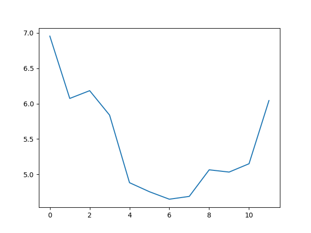
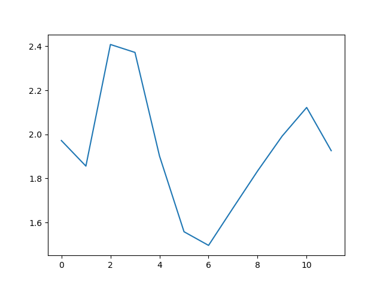
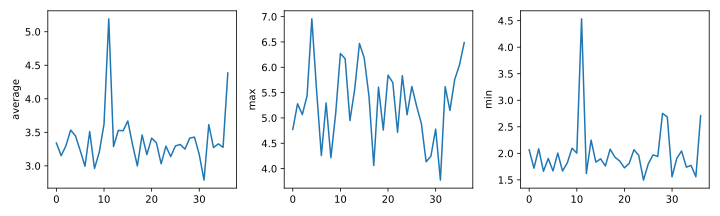
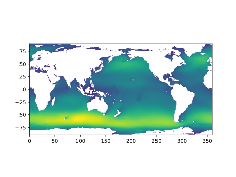
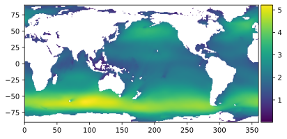

## Visualizing data
The mathematician Richard Hamming once said, "The purpose of computing is insight, not numbers,"
and the best way to develop insight is often to visualize data.  Visualization deserves an entire
lecture of its own, but we can explore a few features of Python's `matplotlib` library here.  While
there is no official plotting library, `matplotlib` is the _de facto_ standard.  First, we will
import the `pyplot` module from `matplotlib` and use two of its functions to create and display a
[heat map]({{ page.root }}/reference.html#heat-map) of our data:

> ## Episode Prerequisites
>
> If you are continuing in the same notebook from the previous episode, you already
> have a `reshaped_data` variable and have imported `numpy`.
> 
> For ease, let's rename the variable:
>
> ~~~
> data = reshaped_data
> ~~~
> {: .language-python}
>
> If you are starting a new notebook at this point, you need the following three lines:
>
> ~~~
> import numpy
> data = numpy.loadtxt(fname='wavesmonthly.csv', delimiter=',', skiprows=1)
> data = numpy.reshape(data[:,2], [37,12]) 
> ~~~
> {: .language-python}
{: .prereq}

~~~
import matplotlib.pyplot
image = matplotlib.pyplot.imshow(data)
matplotlib.pyplot.show()
~~~
{: .language-python}

Each row in the heat map corresponds to a year in the dataset, and each column corresponds to a month.  Blue pixels in this heat map represent low values, while
yellow pixels represent high values. We can see low blue values in the middle (summer) months, and higher waves at the start and end of the year. This demonstrates that there is a seasonal cycle present. With calm summers bringing lower waves, and windy winters generating big waves. There are still differences year to year, with some stormier summers and calmer winters.

Now let's take a look at the average wave-height per month over time:

~~~
ave_waveheight = numpy.mean(data, axis=0)
ave_plot = matplotlib.pyplot.plot(ave_waveheight)
matplotlib.pyplot.show()
~~~
{: .language-python}

This is a good way to smooth out variability, and see what is called a 'climatology', representing the long-term wave climate over several years or decades.

Here, we have put the average wave heights per month across all years in the data
`ave_waveheight`, then asked `matplotlib.pyplot` to create and display a line graph of those
values.  The result is a smooth seasonal cycle, with a maximum in month 0 (January) and minimum in month 6 (July). 
But a good data scientist doesn't just consider the average of a dataset, so let's have a look at two other statistics:

~~~
max_plot = matplotlib.pyplot.plot(numpy.max(data, axis=0))
matplotlib.pyplot.show()
~~~
{: .language-python}

~~~
min_plot = matplotlib.pyplot.plot(numpy.min(data, axis=1))
matplotlib.pyplot.show()
~~~
{: .language-python}

The minimum and maximum graphs show the large spread of all possible wave heights throughout the dataset. There is still a seasonal cycle, but less clear as the extremes are much less smooth. The maximum wave heights can reach a massive 7 metres, and even in the summer the maximum is 4.5m (around the height of a double decker bus!) The minimum values are more similar throughout the year, varying between 1.5 and 2.5 metres. 

Plotting the data in this way, allows us to get a broad picture of the wave climate, without having to examine
the numbers themselves without visualization tools.

### Grouping plots
You can group similar plots in a single figure using subplots.
This script below uses a number of new commands. The function `matplotlib.pyplot.figure()`
creates a space into which we will place all of our plots. The parameter `figsize`
tells Python how big to make this space. Each subplot is placed into the figure using
its `add_subplot` [method]({{ page.root }}/reference.html#method). The `add_subplot` method takes
3 parameters. The first denotes how many total rows of subplots there are, the second parameter
refers to the total number of subplot columns, and the final parameter denotes which subplot
your variable is referencing (left-to-right, top-to-bottom). Each subplot is stored in a
different variable (`axes1`, `axes2`, `axes3`). Once a subplot is created, the axes can
be titled using the `set_xlabel()` command (or `set_ylabel()`).
Let's create three new plots, side by side, this time showing within each of the 37 years of the dataset - notice how we now use `axis=1` in our calls to the summary statistic functions:

~~~
fig = matplotlib.pyplot.figure(figsize=(10.0, 3.0))

axes1 = fig.add_subplot(1, 3, 1)
axes2 = fig.add_subplot(1, 3, 2)
axes3 = fig.add_subplot(1, 3, 3)

axes1.set_ylabel('Average')
axes1.set_xlabel('Year index')
axes1.plot(numpy.mean(data, axis=1))

axes2.set_ylabel('Max')
axes2.set_xlabel('Year index')
axes2.plot(numpy.max(data, axis=1))

axes3.set_ylabel('Min')
axes3.set_xlabel('Year index')
axes3.plot(numpy.min(data, axis=1))

fig.tight_layout()

matplotlib.pyplot.savefig('wavedata.png')
matplotlib.pyplot.show()
~~~
{: .language-python}

This script tells the plotting library
how large we want the figure to be,
that we're creating three subplots,
what to draw for each one,
and that we want a tight layout.
(If we leave out that call to `fig.tight_layout()`,
the graphs will actually be squeezed together more closely.)

The call to `savefig` stores the plot as a graphics file. This can be
a convenient way to store your plots for use in other documents, web
pages etc. The graphics format is automatically determined by
Matplotlib from the file name ending we specify; here PNG from
'wavedata.png'. Matplotlib supports many different graphics
formats, including SVG, PDF, and JPEG.

> ## Importing libraries with shortcuts
>
> In this lesson we use the `import matplotlib.pyplot`
> [syntax]({{ page.root }}/reference.html#syntax)
> to import the `pyplot` module of `matplotlib`. However, shortcuts such as
> `import matplotlib.pyplot as plt` are frequently used.
> Importing `pyplot` this way means that after the initial import, rather than writing
> `matplotlib.pyplot.plot(...)`, you can now write `plt.plot(...)`.
> Another common convention is to use the shortcut `import numpy as np` when importing the
> NumPy library. We then can write `np.loadtxt(...)` instead of `numpy.loadtxt(...)`,
> for example.
>
> Some people prefer these shortcuts as it is quicker to type and results in shorter
> lines of code - especially for libraries with long names! You will frequently see
> Python code online using a `pyplot` function with `plt`, or a NumPy function with
> `np`, and it's because they've used this shortcut. It makes no difference which
> approach you choose to take, but you must be consistent as if you use
> `import matplotlib.pyplot as plt` then `matplotlib.pyplot.plot(...)` will not work, and
> you must use `plt.plot(...)` instead. Because of this, when working with other people it
> is important you agree on how libraries are imported.
{: .callout}

> ## Plot Scaling
>
> Why do all of our plots stop just short of the upper end of our graph?
>
> > ## Solution
> > Because matplotlib normally sets x and y axes limits to the min and max of our data
> > (depending on data range)
> {: .solution}
>
> If we want to change this, we can use the `set_ylim(min, max)` method of each 'axes',
> for example:
>
> ~~~
> axes3.set_ylim(0,8)
> ~~~
> {: .language-python}
>
> Update your plotting code to automatically set a more appropriate scale.
> (Hint: you can make use of the `max` and `min` methods to help.)
>
> > ## Solution
> > ~~~
> > # One method
> > axes3.set_ylabel('min')
> > axes3.plot(numpy.min(data, axis=1))
> > axes3.set_ylim(0,8)
> > ~~~
> > {: .language-python}
> {: .solution}
>
> > ## Solution
> > ~~~
> > # A more automated approach
> > min_data = numpy.min(data, axis=1)
> > axes3.set_ylabel('min')
> > axes3.plot(min_data)
> > axes3.set_ylim(numpy.nanmin(min_data), numpy.nanmax(min_data) * 1.1)
> > ~~~
> > {: .language-python}
> {: .solution}
{: .challenge}

> ## Plotting multiple graphs on one pair of axes 
>
> We can also plot more than one dataset on a single pair of axes, and Matplotlib gives us lots of control over
> the output. Can you plot the maximum, minimum, and mean all on the same axes, change the colour and marker used for each of the plots,
> and give the plot a legend?
>
> > ## Solution
> > We can call `plot` multiple times before we call `show`, and each of those will be added to the axes. We can also
> > specify format options as a string (this needs to specified straight after the data to plot), with all available options
> > listed in [the documentation](https://matplotlib.org/stable/api/_as_gen/matplotlib.pyplot.plot.html). We also need to specify 
> > `label`s for each plot, and call `legend()` to make the legend visible. 
> >
> > An example would be
> >
> > ~~~
> > matplotlib.pyplot.plot(numpy.max(data, axis=0), "bo", label='Maximum')
> > matplotlib.pyplot.plot(numpy.average(data, axis=0), "m+", label='Average')
> > matplotlib.pyplot.plot(numpy.min(data, axis=0), "r--", label='Minumum')
> > matplotlib.pyplot.legend(loc='best')
> >
> > matplotlib.pyplot.show()
> > ~~~
> > {: .language-python}
> 
> {: .solution}
{: .challenge}

> ## Make Your Own Plot
>
> Create a plot showing the standard deviation (`numpy.std`)
> of the wave data across all months.
>
> > ## Solution
> > ~~~
> > std_plot = matplotlib.pyplot.plot(numpy.std(data, axis=0))
> > matplotlib.pyplot.show()
> > ~~~
> > {: .language-python}
> {: .solution}
{: .challenge}

> ## Moving Plots Around
>
> Modify the program to display the three plots on top of one another
> instead of side by side.
>
> > ## Solution
> > ~~~
> > # change figsize (swap width and height)
> > fig = matplotlib.pyplot.figure(figsize=(3.0, 10.0))
> >
> > # change add_subplot (swap first two parameters)
> > axes1 = fig.add_subplot(3, 1, 1)
> > axes2 = fig.add_subplot(3, 1, 2)
> > axes3 = fig.add_subplot(3, 1, 3)
> >
> > axes1.set_ylabel('average')
> > axes1.plot(numpy.mean(data, axis=1))
> >
> > axes2.set_ylabel('max')
> > axes2.plot(numpy.max(data, axis=1))
> >
> > axes3.set_ylabel('min')
> > axes3.plot(numpy.min(data, axis=1))
> >
> > fig.tight_layout()
> >
> > matplotlib.pyplot.show()
> > ~~~
> > {: .language-python}
> {: .solution}
{: .challenge}

### NetCDF files

What about data stored in other types of files? Scientific data is often stored in
[NetCDF](https://en.wikipedia.org/wiki/NetCDF) files. We can also read these files
easily with python, but we use to use a different library

We will again use data describing sea waves, but this time looking at a spatial map. This data set shows a static world map, containing data with the multi-year average wave climate. Again, hs_avg is the wave height in metres. But this time, the shape of the matrix is latitude x longitude

> ## Using other libraries
>
> For the rest of this lesson, we need to use a python library that isn't included in the default
> installation of Anaconda. There are various ways to doing this, depending on how you opened the Jupyter Notebook:
>
> If you're using Anaconda Navigator:
> - return to the main window of Anaconda Navigator
> - select "Environments" from the left-hand menu, and then "**base** (root)"
> - Select the Not Installed filter option to list all packages that are available in the environment’s channels, but not installed.
> - Select the name of the package you want to install. We want `NetCDF4`
> - Click Apply
>
> If you opened the Jupyter Notebook via the command line:
> - you'll need to close the Notebook (Ctrl+C, twice)
> - run the command, and accept the prompt (`y`)
{: .callout}

~~~
import netCDF4 as nc
~~~
{: .language-python}

We can then import a netCDF file, and check to see what python thinks its type is:

~~~
globaldata = nc.Dataset("multyear_hs_avg.nc")
print(type(globaldata))
~~~
{: .language-python}

~~~
<class 'netCDF4._netCDF4.Dataset'>
~~~
{: .output}

We can use Matplotlib to display this data set as a world map. The data go from -90 degrees (south pole) to +90 degrees (north pole) in the y direction. In the x-direction the data go from 0 to 360 degrees East, starting at the Greenwich meridian. The white areas are land, because we have no data there to plot.

~~~
matplotlib.pyplot.imshow(globaldata["hs_avg"][0], extent=[0,360,-90,90], origin='lower')
matplotlib.pyplot.show()
~~~
{: .language-python}

NetCDF files can be quite complex, and normally consist of a number of variables stored as 2D or 3D arrays. `globaldata["hs_avg"]`
is getting a variable called *hs_avg*, which is of type `netCDF4._netCDF4.Variable` (the full list of variables stored can be listed with
`gdata.variables.keys()`). We can use the first element of `globaldata["hs_avg"]` to plot the global map using the `imshow()` function.
Although the type of this element is `numpy.ma.core.MaskedArray`, the `imshow()` function can natively use this variable type as input.

We then need to specify that the data axes of the plot need to go from 0 to 360 on the x-axis, and -90 to 90 on the y-axis. We also use
`origin='lower'` to stop the map being displayed upside down, because we want the map being plotted from the bottom-left, rather than the top-left 
which is the default for plotting matrix-type data (because this is where `[0:0]` normally is).

We can also add a colour bar to help describe the figure, with a little more code:

~~~
import mpl_toolkits

matplotlib.pyplot.figure()
ax = matplotlib.pyplot.gca()
im = ax.imshow(globaldata["hs_avg"][0], extent=[0,360,-90,90], origin='lower')

divider = mpl_toolkits.axes_grid1.make_axes_locatable(ax)
cax = divider.append_axes("right", size="5%", pad=0.05)

matplotlib.pyplot.colorbar(im, cax=cax)
~~~
{: .language-python}

Here, we don't need to use the `mpl_toolkits` library, but it's useful to help format the colourbar.


